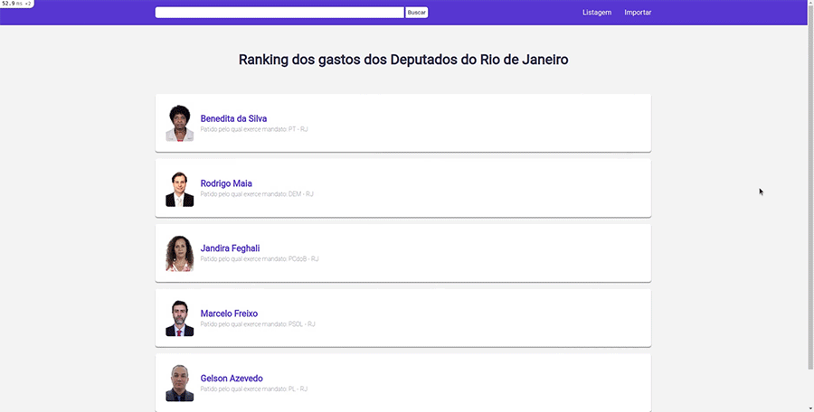

<h1 align="center">
  Ranking of the Deputies expense of Rio de Janeiro
</h1>

<p align="center">Project made with Ruby On Rails, SASS and Postgresql.</p>

##  Features

* List all deputies in Rio de Janeiro.
* Show and highlight them main spents.
* Import CSV file with the data of this deputies.
* You can download the CSV file in: [CSV File](https://dadosabertos.camara.leg.br/swagger/api.html#staticfile)

<p align="center">
  
</p>

<p align="center">
  
</p>

<p align="center">
  
</p>

## Installation
First of all you must have installed Ruby and Ruby On Rails to run this project.
Check out how to do this with [RVM](https://rvm.io/).

You also need have installed [PostgreSql](https://www.postgresql.org/download/) to create the database.

<br/>

You must clone this repository.

```
  git clone git@github.com:marcuspereiradev/parliamentary_spending_ranking.git
```

<p align="center">
  
</p>

<br />

Inside the created directory, configure Dotenv and run the scripts in order to execute the application.

<p align="center">
  
</p>

<br />

```
  // Install the dependencies
  bundle install
```

<p align="center">
  
</p>

<br />

```
  // Create the database
  rails db:create
```

<p align="center">
  
</p>

<br />

```
  // Run the migrations
  rails db:migrate
```

<p align="center">
  
</p>

<br />

```
  // Start the application
  rails s
```

<p align="center">
  
</p>

<br/>

Open your browser and access your localhost

```
  https://localhost:3000
```

## License
This project is under MIT license. See the archive [LICENSE](LICENSE.md) to more details.

## Authors

|  [Marcus Pereira](https://github.com/marcuspereiradev)   |
